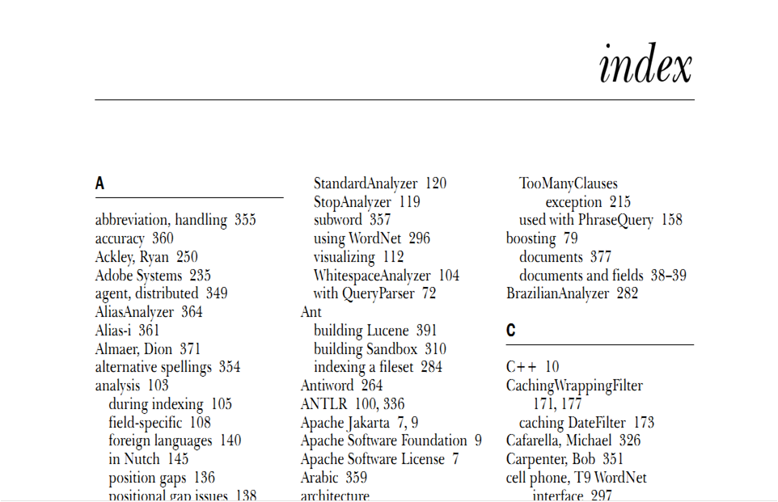

:mag: Information Retrieval 
===
## The Ultimate Guide  :100:
### :arrow_right: Inverted Index, Lucene, Elasticsearch and Kibana
#
#

#### :waning_gibbous_moon: Soulaymen Chouri 
>- Email: [doit@praisethemoon.org](doit@praisethemoon.org)
>- Website: [https://praisethemoon.org](https://praisethemoon.org)
>- Github: [https://github.com/praisethemoon](https://github.com/praisethemoon) 

---

About Me:
===
- Soulaymen Chouri
- R&D Software Engineer @ 
- Interests:
	- Aritificial Intelligence
	- Game Development
	- Information Retrieval :white_check_mark: 
	- Data visualization :white_check_mark:

---

I. Inverted Index
===

---

Let's get started!
===
### :thought_balloon: Imagine:
- We have a lot of documents
- We need to search for a document by some of its content

Let's make a Google-like seach engine!

---

I know what you're thinking
===
```ocaml
let words: String[] = query.split(" ")
let documents: Array<Document> = getDocuments()
let results: Array<UInt32> = new Array<>(defaultValue: 0, 
                                        size: documents.size)

let i: UInt32 = 0

for i = 0, i < documents.size(), i++{
   let content = documents[i].getContent()
   
   foreach w: String in words {
      if content.find(w) > 0 {
         results[i]++
      }
   }
}
```

---

Let's measure performance! :chart_with_downwards_trend:
===
- Comparing two Strings takes `t = 100µs` ([real life example](https://thisdata.com/blog/timing-attacks-against-string-comparison/))
- `n`: number of documents
- `m`: average number of words in all documents
- `w`: number of words in our query

:arrow_right: Complexity: `O(n*m*w)` Total time: `n*m*w*t`

---

Let's measure performance! :books:
===
- For `n = 1k`
- For `m = 10k`
- For `w = 5`

:arrow_right: Total time: `n*m*w*t = 1k*10k*5*t = 50k²t = 50.000.000t`
:arrow_right: Total time: `50.000.000 * 100µs = 1.38 hours` :watch: 

---

Google be like  :joy: :joy: :joy: 
===


---

:tophat: Magic! 
===


- We don't even have as many documents as google (obviously)
- Yet, we're too far away!


--- 

The secret :dizzy:
===



---

A look-up table! :scream:
===

**Indexing** the document:
- Creating a list of `Inverted Indexes`


---

Process:
===
1. Extract document's content
2. Each **term** in the content will be mapped in an **inverted index** as a `term` and a `posting list`
	- As in **map-reduce**
3. When Search for a word, we search in our look-up table

---

Inverted Index:
===

|Term|Posting List|
|:---:|:---:|
| `Lucene`| `{1, 5, 3}`|
| `Java`| `{1, 6}`|

---

Example:
===

- Document[1]: `The big brown fox jumped over the lazy dog`
- Document[2]: `The brown fox is Firefox`

---

Inverted Index:
===
|Term|Posting List|
|:---:|:---:|
| `The`| `{1, 2}`|
| `big`| `{1}`|
| `brown`| `{1, 2}`|
| `fox`| `{1, 2}`|
| `jumped`| `{1}`|
| `over`| `{1}`|
| `lazy`| `{1}`|
| `dog`| `{1}`|
| `is`| `{2}`|
| `Firefox`| `{2}`|

---

Enhance IR: :star:
===
- Add position to the posting list
- Add number of occurrences
- Sort the Inverted Index by alphabet on the term's field!
- Remove non-sense words like `the`, `a`, `at`, ... (language specific)

---

Scoring :star2:
===

- TF: Term Frequence: The more terms(in our query) our document has, the better it is (higher score)
- DF: Document Frequence: The more documents containing that term, the less special this document is (lower score)

- `IDF = 1 / DF`

:arrow_right: `Score = TF*IDF`

---

II. Lucene 
===


---

About Lucene
===

- Open Source IR Library written in Java
- Maintained by the Apache Software Foundation
- The kernel of Solr and Elasticsearch

---

A Lucene Document
===
- Lucene is able to index and store document for fast retrieval via inverted indexes.
- In lucene a document is a data structure in the form of `key, value`.

---

Example:
===

Email document:
- `sender: String`
- `subject: String`
- `sendDate: Date`
- `body: String`

---

Lucene ABCs
===

When creating a document:

- Specify every field type
- If the field is for indexing or not
- If the field is stored or not

:arrow_right: You may want to store a field `send` but you do not want users to search for it.
:arrow_right: You may want to index a field `subject` but you do not want its content to be visible to the user.

---

Lucene ABCs
===
A document is indexed in a **directory**.
:arrow_right: Need to manually create the directory used to store the indexes.
- Lucene stores indexes in the form of segments
- Each segment

---

III. Elasticsearch
===


---

About Elasticsearch
===

- Lucene-based Search Engine
- Scalable and distributed 
- HTTP web interface
- JSON-based documents
- Apache Licensed

---

Installing Elasticsearch
===

:warning: Requires at least Java 8

1. Download ES: [https://www.elastic.co/downloads/elasticsearch](https://www.elastic.co/downloads/elasticsearch)
2. Extract Zip
3. cmd: `bin\elasticsearch`

---

Creating our first document :book:
===

```sh
curl -XPUT http://localhost:9200/users/user/1 -d `
{
   "name": "James",
   "age": 35,
   "lastlogin": "2017-02-01",
   "bio": "A Secret agent known as James Bond. 
           He is simply the man to get the job done"
}
```

---

Retrieving our first document
===

```sh
curl -XGET /user/users/_search?q="name":"james"&pretty
```

---

First impressions:
===
- Elasticsearch is Schema-free
	- Automatically deduct field types
	- Can update mapping if miss detected
- Can be used from any programming language that can send Http Requests
- Very scalable: from personal computers to data centers.

---


